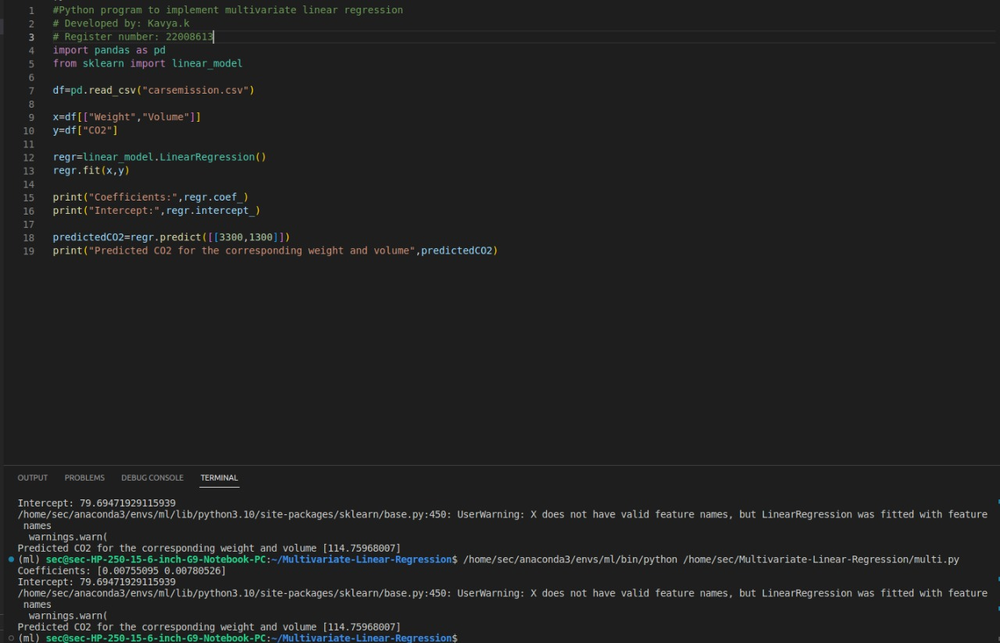

# Implementation of Multivariate Linear Regression
## Aim
To write a python program to implement multivariate linear regression and predict the output.
## Equipment’s required:
1.	Hardware – PCs
2.	Anaconda – Python 3.7 Installation / Moodle-Code Runner
## Algorithm:
### Step1
Import panda as pd.

## Step2
use pd.read_csv to find weight and volume.

## Step3
Run the program and take the screenshot of the output

## Step4
End of the program

## Program:
```
#Developed by :kavya.k
#Register Number:22008613
import pandas as pd
from sklearn import linear_model

df = pd.read_csv("csvfile.csv")
 
x = df[['Weight','Volume']]
y = df["CO2"]
 
regr = linear_model.LinearRegression()
regr.fit(x,y)
 
print('coefficients:', regr.coef_)
print('Intercept:',regr.intercept_)
 
predictedCO2 = regr.predict([[3300,1300]])
print('predicted CO2 for the corresponding weight and volume',predictedCO2)


```
## Output:



## Result
Thus the multivariate linear regression is implemented and predicted the output using python program.